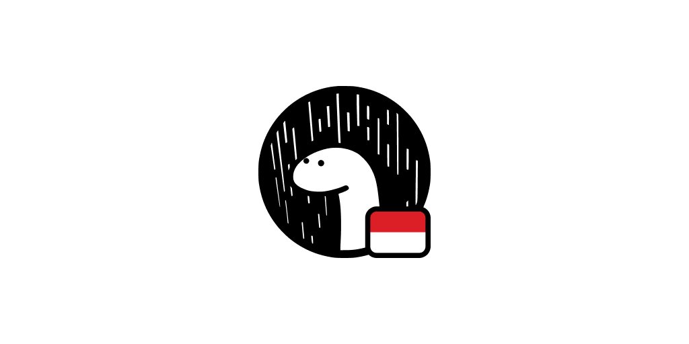

<!-- markdownlint-disable MD014 MD033 MD041 -->

---

## Contributing

Thanks goes to these wonderful people ([emoji key](https://allcontributors.org/docs/en/emoji-key)):

<!-- ALL-CONTRIBUTORS-LIST:START - Do not remove or modify this section -->
<!-- prettier-ignore-start -->
<!-- markdownlint-disable -->
<table>
  <tr>
    <td align="center"><a href="https://griko.id"> <b>Griko Nibras</b></a> <a href="https://github.com/denoland-id/denoland.id/commits?author=grikomsn" title="Code">💻</a> <a href="#maintenance-grikomsn" title="Maintenance">🚧</a></td>
  </tr>
</table>

<!-- markdownlint-enable -->
<!-- prettier-ignore-end -->

<!-- ALL-CONTRIBUTORS-LIST:END -->

This project follows the [all-contributors][all-contributors] specification.
Contributions of any kind welcome!

## License

[MIT License, Copyright (c) 2020 Deno Land Indonesia](https://github.com/denoland-id/denoland.id/blob/master/LICENSE)

[all-contributors]: https://github.com/all-contributors/all-contributors
